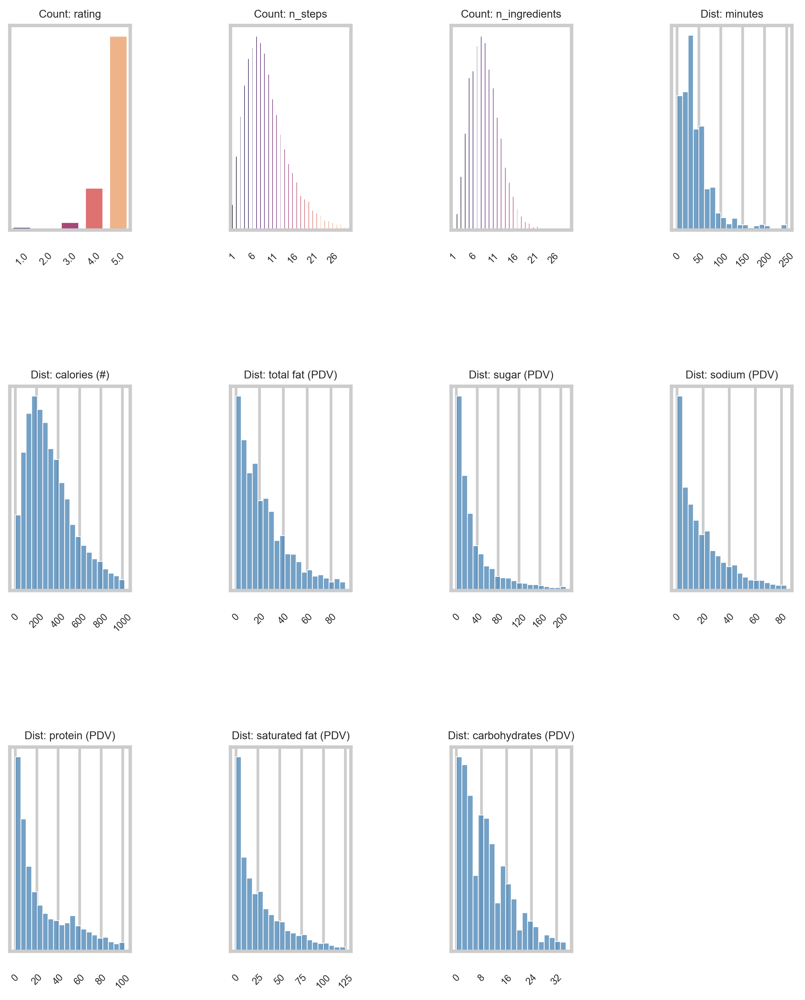

# User satisfaction prediction analysis based on recipe nutrition and complexity
by Jinxin Xiao

## Overview
This project analyzes the nutritional data and preparation complexity of recipes, and uses machine learning to predict user satisfaction.

## Introduction
This study aims to explore the intrinsic logic between "taste preferences" and "healthy ingredients" in modern food culture by deeply 
analyzing the massive amount of recipes and accompanying review data on the Food.com platform. The project will focus on user behavior 
characteristics and recipe content characteristics: on the one hand, by analyzing the emotional tendencies expressed by users in their 
reviews, key taste factors (such as the salt-to-sweet ratio and fat content) leading to high or low scores will be identified, thus 
outlining the taste profiles of different user groups; on the other hand, by combining the number of cooking steps, time, and detailed 
nutritional composition (protein, fat, sugar, etc.) of the recipes, the correlation between healthy eating and cooking complexity will be
assessed. Ultimately, this project hopes to establish a multi-dimensional evaluation system that can not only recommend dishes that match 
users' historical preferences but also provide scientific insights and suggestions for healthy dietary ratios and recipe improvements from 
a data perspective.

### Dataset Introduction: 
User Reviews: 
This dataset, represented as df_reviews, contains the feedback and interaction history from users regarding various recipes. It serves as the primary source for our sentiment analysis and target labels.

Total Rows: 731,927

Total Columns: 5

| Column Name | Data Type | Description |
| :--- | :--- | :--- |
| **`user_id`** | int64 | The unique identifier for the user who posted the review. |
| **`recipe_id`** | int64 | The unique identifier for the recipe being reviewed. |
| **`date`** | object | The date when the review was submitted. |
| **`rating`** | int64 | The numerical score provided by the user (1–5 scale). |
| **`review`** | object | The text content of the user's feedback and experience. |

Recipes
The df_recipes dataset contains detailed metadata for each recipe, providing the structural and nutritional features used to predict user satisfaction.

Total Rows: 231,637

Total Columns: 12

| Column Name | Data Type | Description |
| :--- | :--- | :--- |
| **`name`** | object | The title of the recipe. |
| **`id`** | int64 | Unique identifier for the recipe (used for merging with reviews). |
| **`minutes`** | int64 | Total time required to prepare the recipe. |
| **`contributor_id`** | int64 | Unique identifier for the user who submitted the recipe. |
| **`submitted`** | object | The date the recipe was first posted. |
| **`tags`** | object | A list of descriptive tags (e.g., "low-carb," "dinner"). |
| **`nutrition`** | object | A list containing specific nutritional values (Calories, Fat, Sugar, etc.). |
| **`n_steps`** | int64 | The total number of steps in the cooking process. |
| **`steps`** | object | The detailed text descriptions of each cooking step. |
| **`description`** | object | A summary or introduction provided by the author. |
| **`ingredients`** | object | A list of the specific food items required. |
| **`n_ingredients`** | int64 | The total count of ingredients used. |

We are currently using the two databases mentioned above to predict user preferences based on recipe complexity and health value. To facilitate model training, in subsequent data cleaning, we split or converted non-numerical features into numerical features using text processing tools. For example, **nutrition** is split into seven new features, and user text reviews are converted into **(1, 0, -1)** numerical features to work in conjunction with ratings, etc.

This project, based on the massive dataset from Food.com, aims to explore the underlying logic between healthy ingredients and taste preferences. By analyzing user review sentiment and recipe data, we will reveal the key factors influencing ratings and assess the correlation between cooking complexity and dietary health, thereby establishing a multi-dimensional recipe evaluation and recommendation system.

## Data Cleaning and Exploratory Analysis

To ensure high-quality inputs for our analysis and machine learning models, we performed a series of data cleaning and feature engineering steps on the raw datasets.

1. Merging Datasets
We performed an Inner Join between df_recipes and df_reviews to link recipe metadata with user feedback.

- Key: Linked using id (from recipes) and recipe_id (from reviews).

- Goal: To create a unified dataset where each row represents a unique user interaction with specific recipe attributes.

2. Handling Missing and Zero Ratings
On Food.com, a rating of 0 often indicates that a user left a review without providing a score.

- Action: We filtered out or imputed these 0-value ratings to prevent them from skewing the average satisfaction metrics.

- Text Cleaning: Rows with empty review strings were removed to maintain the integrity of our sentiment analysis.

3. Nutritional Feature Engineering
The original nutrition column was stored as a string representation of a list (e.g., [242.5, 12.0, 25.0, ...]).

- Action: We parsed and expanded this column into individual numerical features: calories (#), total fat (PDV), sugar (PDV), sodium (PDV), and protein (PDV).

- Normalization: All "Percentage of Daily Value" (PDV) values were converted to floats for statistical consistency.

4. Sentiment Categorization
To simplify the prediction task, we mapped the original 1–5 numerical rating into three categorical sentiment labels:

-  Positive (1): 5 stars

-  Neutral (0): 3-4 stars

-  Negative (-1): 1–2 stars

5. Outlier Removal and Filtering
We identified and removed records with unrealistic values that could negatively impact model performance:

- Time & Complexity: Filtered out recipes with minutes that were logically impossible.

6. Recipe Feature Engineering (Content Characteristics)
To quantify "healthy eating" and "recipe complexity" as mentioned in our overview, we derived the following:

- Cooking Efficiency: Created a ratio of n_steps to minutes to identify recipes that are "fast but labor-intensive" versus "slow but simple."

- Health Profiles: Categorized recipes into "High/Low Sugar" or "High/Low Fat" groups based on whether their PDV values exceeded the dataset median.

- Ingredient Density: Used n_ingredients as a proxy for the logistical complexity of the recipe.

7. User Feature Engineering (Behavior Characteristics)
We aggregated the interaction data to understand user-specific tendencies:

- User Engagement Level: Calculated the total number of reviews left by each user_id to distinguish between "power users" and "casual reviewers."

- User Rating Bias: Calculated the average rating given by each user to determine if certain users are consistently "harsh" or "lenient" in their scoring.

- Taste Profiles: Identified user preferences by tracking the average nutritional values (e.g., average sugar (PDV)) of the recipes they rated highly.

8. Interaction Mapping (The Bridge)
We created a final analytical table that captures the "interaction" between the user and the recipe:

- Experience Matching: We looked at whether a user's historical preference (e.g., a history of liking low-calorie recipes) aligns with the current recipe's profile.

- Time-Series Trends: Analyzed the date of the review relative to the submitted date of the recipe to see if user satisfaction changes as a recipe "ages" or becomes a classic on the platform.

### Univariate Analysis
- Rating Characteristics: User ratings are extremely concentrated around 5.0, exhibiting a significant negative skewness.

- Cooking Threshold: Most recipes have 5–15 steps and take less than 60 minutes.

- Nutritional Distribution: Indicators such as sugar, sodium, and fat show a long-tailed distribution, with most recipes maintaining a low percentage-of-daily intake (PDV) level.

### Bivariate Analysis
First, we considered whether the number of steps was the sole factor influencing the final result. However, the persistent presence of dark blocks at the top, as shown in the graph, indicates that highly complex recipes can maintain high satisfaction levels. The data points did not significantly shift towards the negative rating area at the bottom as the number of steps increased, further demonstrating that there is no significant negative correlation between cooking difficulty and user satisfaction.

### Interesting Aggregates
| Feature Name           | Negative (-1) | Neutral (0) | Positive (1) | Pos/Neg Ratio |
|:-----------------------|:-------------:|:-----------:|:------------:|:-------------:|
| **Calories (#)** | 442.29        | 455.08      | 413.41       | **0.93** |
| **Total Fat (PDV)** | 33.85         | 35.16       | 31.40        | **0.93** |
| **Sugar (PDV)** | 69.50         | 67.04       | 62.24        | **0.90** |
| **Sodium (PDV)** | 29.04         | 48.14       | 28.55        | **0.98** |
| **Protein (PDV)** | 34.03         | 36.06       | 32.89        | **0.97** |
| **Saturated Fat (PDV)**| 43.09         | 43.50       | 38.69        | **0.90** |
| **Carbohydrates (PDV)**| 14.10         | 14.09       | 13.04        | **0.92** |
| **n_steps** | 10.41         | 10.44       | 9.91         | **0.95** |
| **Minutes** | 167.94        | 94.56       | 101.71       | **0.61** |

This pivot table summarizes the average nutritional values and recipe complexity (steps and time) categorized by user sentiment levels. By introducing the "Pos/Neg Ratio," we can quantitatively observe how recipes that received positive feedback differ from those that received negative feedback; for instance, a ratio greater than 1.0 in sugar or total fat would suggest that users tend to respond more favorably to "richer" or "sweeter" dishes.

The significance of this aggregation lies in its ability to bridge the gap between objective nutritional facts and subjective user satisfaction. It helps identify specific dietary factors—such as sugar content or preparation time—that consistently correlate with positive user experiences, providing a strong empirical basis for our subsequent predictive modeling and hypothesis testing.

## Assessment of Missingness¶
### NMAR Analysis
In our dataset, the review column is likely NMAR (Not Missing At Random). This is because the decision to leave a review often depends on the user's unobserved level of motivation or the intensity of their experience; a user might skip writing a review simply because they felt "neutral" or had an unremarkable experience, a factor that isn't captured by other variables like cooking time or ingredients. To transition this missingness from NMAR to MAR, we would need additional data such as User Engagement Metrics (e.g., time spent on the recipe page) or User Metadata (e.g., total number of recipes viewed versus reviewed), which could provide an observed explanation for why a user chose to remain silent.

### Missingness Dependency
We investigated the missingness of the review column in our outer merged dataset to determine if it depends on other recipe characteristics. We selected minutes (cooking time) and n_steps (number of steps) as our covariates for the permutation tests.

1. Test 1: Dependency on Minutes
- Null Hypothesis ($H_0$): The missingness of reviews does not depend on the cooking time (minutes).
- Alternate Hypothesis ($H_1$): The missingness of reviews does depend on the cooking time (minutes).
- Test Statistic: The absolute difference of mean minutes between the group with missing reviews and the group with non-missing reviews.
- Significance Level: 0.05
- Observed Statistic: 33.56

2. Test 2: Dependency on Number of Steps
- Null Hypothesis ($H_0$): The missingness of reviews does not depend on the number of steps (n_steps).
- Alternate Hypothesis ($H_1$): The missingness of reviews does depend on the number of steps (n_steps).
- Test Statistic: The absolute difference of mean n_steps between the group with missing reviews and the group with non-missing reviews.
- Significance Level: 0.05
- Observed Statistic: 5.26

Our analysis reveals that the missingness of the review column is not purely random. For minutes, we observed a significant mean difference of 33.56, which resulted in a $p$-value of 0.00. This allows us to reject the null hypothesis, confirming that the missingness of reviews depends on cooking time. Similarly, for n_steps, the observed difference of 5.26 also yielded a significant $p$-value ($p < 0.05$), indicating a dependency on the number of steps. These results suggest that the missingness of reviews is MAR (Missing At Random) with respect to both cooking duration and recipe complexity. A possible explanation is that users are less likely to provide written feedback for recipes that are either exceptionally simple (few steps/minutes) or overly labor-intensive, creating a systematic bias in the qualitative data.

## Hypothesis Testing
In our dataset, user sentiment is heavily skewed toward positive reviews. To understand what drives negative feedback, we compare the complexity of recipes (measured by n_steps) between Positive (1) and Negative (-1) sentiments.
- Null Hypothesis ($H_0$): In a balanced sample of reviews, the average number of steps (n_steps) for positive sentiment recipes is the same as that for negative sentiment recipes.
- Alternative Hypothesis ($H_1$): Negative sentiment reviews have a different average number of steps compared to positive sentiment reviews.
- Test Statistic: The difference in means of n_steps ($Mean_{Negative} - Mean_{Positive}$).
- Significance Level ($\alpha$): 0.05

With a $p$-value of 0.0000, we reject the null hypothesis. Even after equalizing the sample sizes to 7,973 entries per group, we found that recipes with negative sentiment reviews have, on average, 0.61 more steps than those with positive sentiment.

## Framing a Prediction Problem
This project aims to build a **multiclass classification model** to predict user taste preferences (categorized as negative -1, neutral 0, positive 1) by analyzing the core nutritional components and cooking complexity of recipes. To comprehensively capture user feedback, we defined two key response variables: first, `review_feel`, derived from the original 1–5 star rating mapping, reflecting the user's most direct quantitative attitude; and second, `rating_process`, obtained by processing review text using the SentimentIntensityAnalyzer sentiment analysis tool, which effectively uncovers subtle emotional polarities hidden when rating data is overly concentrated around 5 stars.

In feature selection, we strictly adhere to the Time of Prediction principle, using only static information available at the moment of recipe publication, such as core nutritional indicators like calories (#), sugar (PDV), and protein (PDV), as well as operational threshold indicators n_steps and minutes. The use of posterior data such as the total number of reviews or historical average ratings is strictly prohibited. Considering the class imbalance in the dataset, where positive feedback far outnumbers negative feedback, pure accuracy could be misleading due to the model's tendency to blindly guess the majority class. Therefore, we chose F1-Score (Macro) as the core evaluation metric. This metric balances precision and recall, ensuring that the model has equal discriminative and predictive power for each sentiment category (especially negative feedback from the minority).

### Baseline Model
1. Model Description

We chose the Random Forest Classifier as the baseline model. This model captures the non-linear relationship between features and user sentiment by ensembled multiple decision trees. Considering that positive reviews dominate the dataset, we set `class_weight='balanced'` in the model to mitigate the impact of class imbalance on predictions by automatically adjusting class weights.

2. Features & Encoding

The model uses 11 features, all of which are quantitative features derived from the original data:

- User history features: `u_avg_steps`, `u_avg_sugar`, `u_avg_mins`, `u_avg_calo` (continuous values ​​reflecting past user preferences).

- Recipe core metrics and interaction terms: `time_per_step`, `health_index`, `relative_complexity` (continuous values ​​measuring efficiency and relative difficulty).

- Popularity and Bias Indicators: review_count, step_bias, sugar_diff, calories_diff (continuous numerical values ​​measuring recipe popularity and difference from the average).

Coding Notes: Since all selected features are quantitative and do not include categorical or ordinal variables, no additional One-Hot coding or label coding was performed at this stage.

3. Model Performance The model's performance on the test set is as follows:

- Accuracy: 0.76

- Macro Average F1-Score: 0.29

- Performance by Category:

- - Positive (1): Precision 0.76, Recall 1.00, F1 0.86

- - Neutral (0) and Negative (-1): All indicators are almost 0.

4. Is the current model "Good"? Conclusion: The current model is not ideal (Not a "good" model).

While its overall accuracy reached 76%, this was purely due to the model falling into the "majority class trap." Since 76% of the samples in the data were positive (Support: 34,607), the model achieved high accuracy by predicting almost all samples as 1.

- Lack of discrimination: The model completely failed to distinguish between negative (-1) and neutral (0) samples (Recall: 0.00 for each).

- Weak generalization: The Macro Avg F1-Score (0.29) was far lower than the accuracy, indicating that the model completely failed when dealing with the minority class.

- Conclusion: The current feature combinations or model parameters are not yet effective in capturing the key signals that distinguish between "positive" and "negative" reviews. Further feature engineering or more complex oversampling (such as SMOTE) is still needed.
