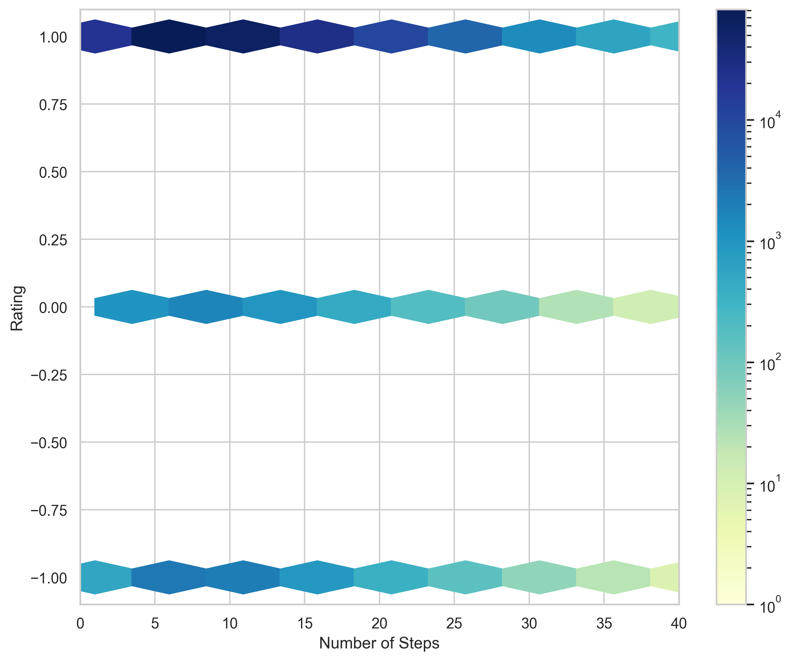
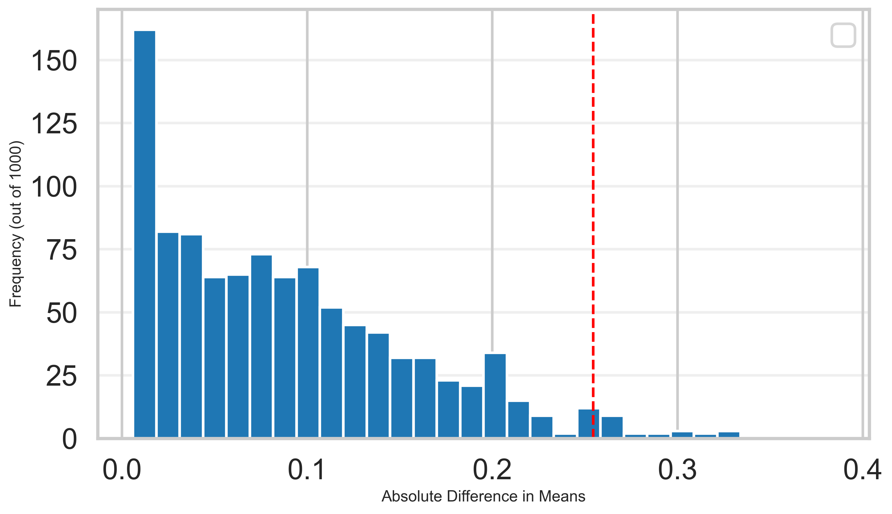
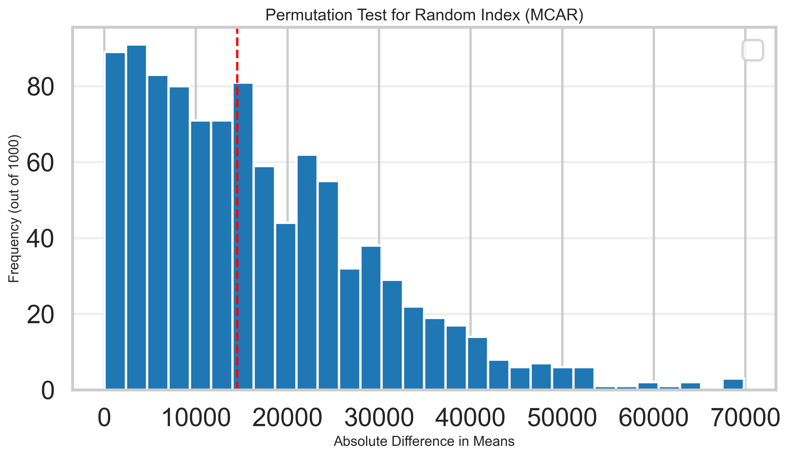
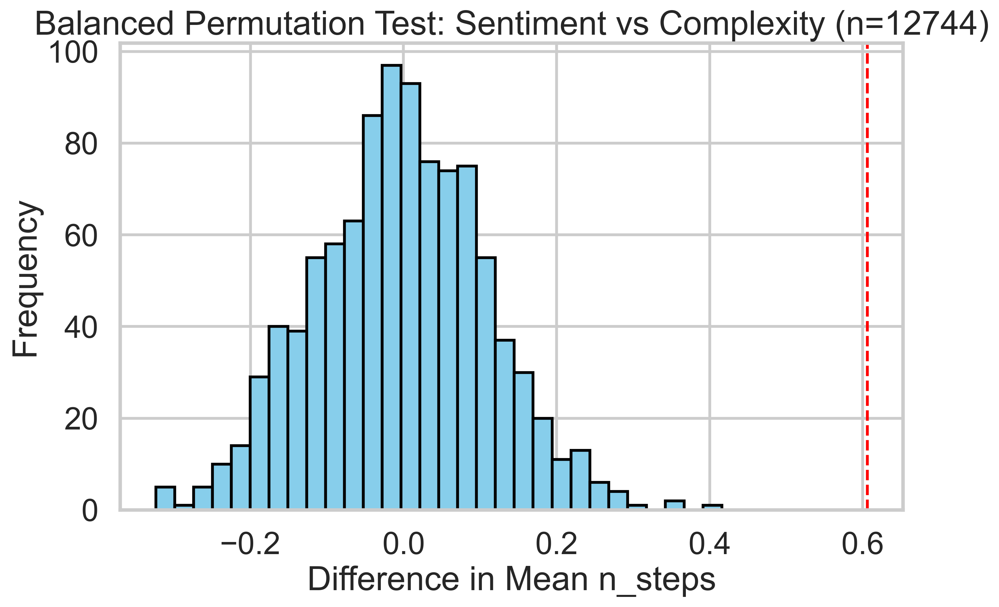
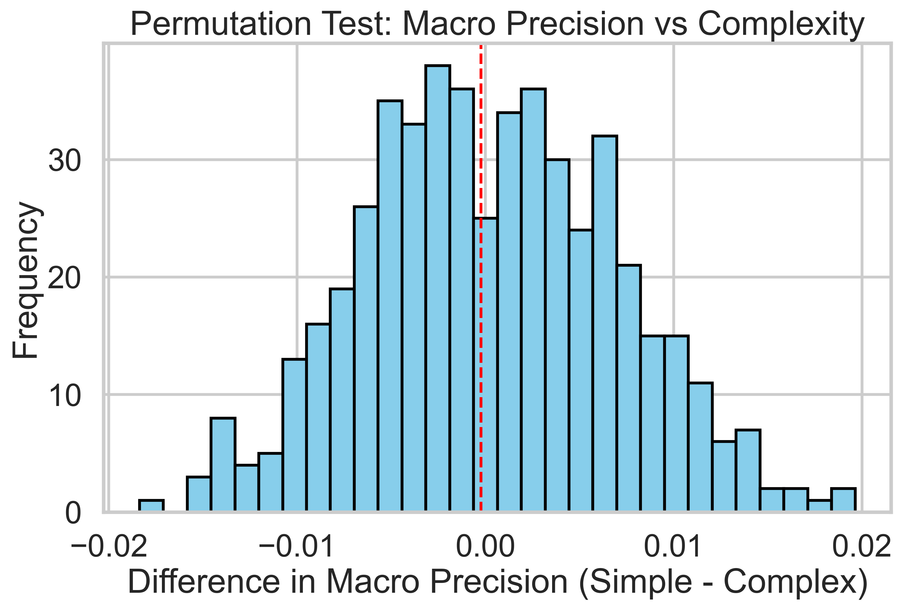

# User satisfaction prediction analysis based on recipe nutrition and complexity
by Jinxin Xiao

## Overview
This project analyzes the nutritional data and preparation complexity of recipes, and uses machine learning to predict user satisfaction.

## Introduction
This study aims to explore the intrinsic logic between "taste preferences" and "healthy ingredients" in modern food culture by deeply 
analyzing the massive amount of recipes and accompanying review data on the Food.com platform. The project will focus on user behavior 
characteristics and recipe content characteristics: on the one hand, by analyzing the emotional tendencies expressed by users in their 
reviews, key taste factors (such as the salt-to-sweet ratio and fat content) leading to high or low scores will be identified, thus 
outlining the taste profiles of different user groups; on the other hand, by combining the number of cooking steps, time, and detailed 
nutritional composition (protein, fat, sugar, etc.) of the recipes, the correlation between healthy eating and cooking complexity will be
assessed. Ultimately, this project hopes to establish a multi-dimensional evaluation system that can not only recommend dishes that match 
users' historical preferences but also provide scientific insights and suggestions for healthy dietary ratios and recipe improvements from 
a data perspective.

### Dataset Introduction: 
User Reviews: 
This dataset, represented as df_reviews, contains the feedback and interaction history from users regarding various recipes. It serves as the primary source for our sentiment analysis and target labels.

Total Rows: 731,927

Total Columns: 5

| Column Name | Data Type | Description |
| :--- | :--- | :--- |
| **`user_id`** | int64 | The unique identifier for the user who posted the review. |
| **`recipe_id`** | int64 | The unique identifier for the recipe being reviewed. |
| **`date`** | object | The date when the review was submitted. |
| **`rating`** | int64 | The numerical score provided by the user (1–5 scale). |
| **`review`** | object | The text content of the user's feedback and experience. |

Recipes
The df_recipes dataset contains detailed metadata for each recipe, providing the structural and nutritional features used to predict user satisfaction.

Total Rows: 231,637

Total Columns: 12

| Column Name | Data Type | Description |
| :--- | :--- | :--- |
| **`name`** | object | The title of the recipe. |
| **`id`** | int64 | Unique identifier for the recipe (used for merging with reviews). |
| **`minutes`** | int64 | Total time required to prepare the recipe. |
| **`contributor_id`** | int64 | Unique identifier for the user who submitted the recipe. |
| **`submitted`** | object | The date the recipe was first posted. |
| **`tags`** | object | A list of descriptive tags (e.g., "low-carb," "dinner"). |
| **`nutrition`** | object | A list containing specific nutritional values (Calories, Fat, Sugar, etc.). |
| **`n_steps`** | int64 | The total number of steps in the cooking process. |
| **`steps`** | object | The detailed text descriptions of each cooking step. |
| **`description`** | object | A summary or introduction provided by the author. |
| **`ingredients`** | object | A list of the specific food items required. |
| **`n_ingredients`** | int64 | The total count of ingredients used. |

We are currently using the two databases mentioned above to predict user preferences based on recipe complexity and health value. To facilitate model training, in subsequent data cleaning, we split or converted non-numerical features into numerical features using text processing tools. For example, **nutrition** is split into seven new features, and user text reviews are converted into **(1, 0, -1)** numerical features to work in conjunction with ratings, etc.

This project, based on the massive dataset from Food.com, aims to explore the underlying logic between healthy ingredients and taste preferences. By analyzing user review sentiment and recipe data, we will reveal the key factors influencing ratings and assess the correlation between cooking complexity and dietary health, thereby establishing a multi-dimensional recipe evaluation and recommendation system.

## Data Cleaning and Exploratory Analysis

To ensure high-quality inputs for our analysis and machine learning models, we performed a series of data cleaning and feature engineering steps on the raw datasets.

1. Merging Datasets
We performed an One-Side Join between df_recipes and df_reviews to link recipe metadata with user feedback.

- Key: Linked using id (from recipes) and recipe_id (from reviews).

- Goal: To create a unified dataset where each row represents a unique user interaction with specific recipe attributes.

2. Handling Missing and Zero Ratings
On Food.com, a rating of 0 often indicates that a user left a review without providing a score.

- Action: We filtered out or imputed these 0-value ratings to prevent them from skewing the average satisfaction metrics.

3. Nutritional Feature Engineering
The original nutrition column was stored as a string representation of a list (e.g., [242.5, 12.0, 25.0, ...]).

- Action: We parsed and expanded this column into individual numerical features: calories (#), total fat (PDV), sugar (PDV), sodium (PDV), and protein (PDV).

4. Sentiment Categorization
To simplify the prediction task, we mapped the original 1–5 numerical rating into three categorical sentiment labels:

-  Positive (1): 5 stars

-  Neutral (0): 3-4 stars

-  Negative (-1): 1–2 stars

5. Recipe Feature Engineering (Content Characteristics)
To quantify "healthy eating" and "recipe complexity" as mentioned in our overview, we derived the following:

- Cooking Efficiency: Created a ratio of n_steps to minutes to identify recipes that are "fast but labor-intensive" versus "slow but simple."

- Health Profiles: Categorized recipes into "High/Low Sugar" or "High/Low Fat" groups based on whether their PDV values exceeded the dataset median.

6. User Feature Engineering (Behavior Characteristics)
We aggregated the interaction data to understand user-specific tendencies:

- User Engagement Level: Calculated the total number of reviews left by each user_id to distinguish between "power users" and "casual reviewers."

- User Rating Bias: Calculated the average rating given by each user to determine if certain users are consistently "harsh" or "lenient" in their scoring.

- Taste Profiles: Identified user preferences by tracking the average nutritional values (e.g., average sugar (PDV)) of the recipes they rated highly.

7. Interaction Mapping (The Bridge)
We created a final analytical table that captures the "interaction" between the user and the recipe:

- Experience Matching: We looked at whether a user's historical preference (e.g., a history of liking low-calorie recipes) aligns with the current recipe's profile.

Result:

| Column Name | Data Type |
| :--- | :--- |
| user_id               | float64   |
| id                    | int64     |
| calories (#)          | float64   |
| sugar (PDV)           | float64   |
| protein (PDV)         | float64   |
| n_steps               | int64     |
| minutes               | int64     |
| final_target          | int64     |
| user_idx              | int64     |
| recipe_idx            | int64     |
| u_avg_steps           | float64   |
| u_avg_sugar           | float64   |
| u_avg_mins            | float64   |
| u_avg_calo            | float64   |
| step_bias             | float64   |
| calories_diff         | float64   |
| sugar_diff            | float64   |
| time_per_step         | float64   |
| health_index          | float64   |
| relative_complexity   | float64   |
| review_count          | int64     |

Final Dataset:

| user_id | id | calories (#) | sugar (PDV) | protein (PDV) | n_steps | minutes | final_target | user_idx | recipe_idx | u_avg_steps | u_avg_sugar | u_avg_calo | step_bias | calories_diff | sugar_diff |
|--------|------|-------------|-------------|---------------|---------|---------|-------------|---------|-----------|-------------|-------------|------------|-----------|--------------|-----------|
| 424680.0 | 453467 | 595.1 | 211.0 | 13.0 | 12 | 45 | 1 | 7045 | 65442 | 9.47 | 94.55 | 403.11 | 1.31 | 191.99 | 116.45 |
| 29782.0 | 306168 | 194.8 | 6.0 | 22.0 | 6 | 40 | 1 | 278 | 13841 | 9.14 | 36.99 | 366.85 | 0.35 | -172.05 | -30.99 |
| 768828.0 | 306168 | 194.8 | 6.0 | 22.0 | 6 | 40 | 1 | 12373 | 13841 | 8.82 | 39.55 | 334.57 | 0.37 | -139.77 | -33.55 |
| 520830.0 | 306168 | 194.8 | 6.0 | 22.0 | 6 | 40 | 1 | 8575 | 13841 | 9.00 | 114.29 | 423.94 | 0.36 | -229.14 | -108.29 |
| 369715.0 | 500166 | 249.4 | 4.0 | 39.0 | 5 | 20 | 0 | 6249 | 77140 | 8.04 | 35.02 | 368.77 | 0.31 | -119.37 | -31.02 |

### Univariate Analysis
- Rating Characteristics: User ratings are extremely concentrated around 5.0, exhibiting a significant negative skewness.

- Cooking Threshold: Most recipes have 5–15 steps and take less than 60 minutes.

- Nutritional Distribution: Indicators such as sugar, sodium, and fat show a long-tailed distribution, with most recipes maintaining a low percentage-of-daily intake (PDV) level.

### Bivariate Analysis
First, we considered whether the number of steps was the sole factor influencing the final result. However, the persistent presence of dark blocks at the top, as shown in the graph, indicates that highly complex recipes can maintain high satisfaction levels. The data points did not significantly shift towards the negative rating area at the bottom as the number of steps increased, further demonstrating that there is no significant negative correlation between cooking difficulty and user satisfaction.

### Interesting Aggregates

| Feature Name           | Negative (-1) | Neutral (0) | Positive (1) | Pos/Neg Ratio |
| :--- | :--- | :--- | :--- | :--- |
| Calories (#) | 442.29        | 455.08      | 413.41       | 0.93 |
| Total Fat (PDV) | 33.85         | 35.16       | 31.40        | 0.93 |
| Sugar (PDV) | 69.50         | 67.04       | 62.24        | 0.90 |
| Sodium (PDV) | 29.04         | 48.14       | 28.55        | 0.98 |
| Protein (PDV) | 34.03         | 36.06       | 32.89        | 0.97 |
| Saturated Fat (PDV)| 43.09         | 43.50       | 38.69        | 0.90 |
| Carbohydrates (PDV)| 14.10         | 14.09       | 13.04        | 0.92 |
| n_steps | 10.41         | 10.44       | 9.91         | 0.95 |
| Minutes | 167.94        | 94.56       | 101.71       | 0.61 |

This pivot table summarizes the average nutritional values and recipe complexity (steps and time) categorized by user sentiment levels. By introducing the "Pos/Neg Ratio," we can quantitatively observe how recipes that received positive feedback differ from those that received negative feedback; for instance, a ratio greater than 1.0 in sugar or total fat would suggest that users tend to respond more favorably to "richer" or "sweeter" dishes.

The significance of this aggregation lies in its ability to bridge the gap between objective nutritional facts and subjective user satisfaction. It helps identify specific dietary factors—such as sugar content or preparation time—that consistently correlate with positive user experiences, providing a strong empirical basis for our subsequent predictive modeling and hypothesis testing.

## Assessment of Missingness¶
### NMAR Analysis
In our dataset, the review column is likely NMAR (Not Missing At Random). This is because the decision to leave a review often depends on the user's unobserved level of motivation or the intensity of their experience; a user might skip writing a review simply because they felt "neutral" or had an unremarkable experience, a factor that isn't captured by other variables like cooking time or ingredients. To transition this missingness from NMAR to MAR, we would need additional data such as User Engagement Metrics (e.g., time spent on the recipe page) or User Metadata (e.g., total number of recipes viewed versus reviewed), which could provide an observed explanation for why a user chose to remain silent.

### Missingness Dependency
In this section, we investigate the mechanism of missingness for the review column (which contains 169 missing values). Our goal is to determine whether the absence of a text review is purely accidental or if it systematically relates to other variables in the dataset.

To achieve this, we performed Permutation Tests (1,000 iterations) on a 1:1 balanced sample of missing and non-missing data. We tested two primary scenarios:

MAR (Missing at Random): To find a feature that the missingness depends on.

MCAR (Missing Completely at Random): To find a feature that the missingness is independent of, serving as a control to validate our statistical consistency.

1. Test 1: Dependent Case: Review Missingness Dependence on Rating 

- Experimental Background: We investigate whether users' decision to leave a written review is related to their rating.

- Null Hypothesis ($H_0$): Missing reviews are independent of ratings. That is, there is no significant difference in rating distribution between samples with missing reviews and samples with written reviews.

- Alternative Hypothesis ($H_a$): Missing reviews depend on ratings. That is, users with different rating preferences are more likely to leave a written review (MAR).

- Test Statistic: Absolute Difference in Means between the mean ratings of the missing and non-missing groups.

- Significance Level ($\alpha$): 0.05

Conclusion:

- The experimentally obtained p-value is approximately 0.034. Since p < 0.05, we reject the null hypothesis ($H_0$). This indicates that the missing reviews exhibit Missing at Random (MAR) characteristics, with the missing rate significantly dependent on the user ratings given. Users who typically give average scores (e.g., 3-4 stars) are more likely to ignore written reviews, while users with extreme ratings are more likely to leave comments.

2. Independent Case: Review Missingness Dependency on random_index

- Experimental Background: To verify the testing logic and provide an independence comparison, we introduce an absolutely random feature, random_index.

- Null Hypothesis ($H_0$): Missing reviews are independent of random_index. The distributions of the two groups on the random feature should be essentially the same.

- Alternative Hypothesis ($H_a$): Missing reviews depend on random_index.

- Test Statistic: The absolute difference between the mean random_index of the missing and non-missing groups.
- Significance Level ($\alpha$): 0.05

Conclusion:

- The experimentally obtained p-value $\approx$ is 0.497 (example value). Since $P > 0.05$, we cannot reject the null hypothesis ($H_0$). This demonstrates that there is no statistical association between the lack of review and the randomness characteristic. This result conforms to the definition of Missing Completely at Random (MCAR) and validates the effectiveness of our permutation test in identifying randomness.

## Hypothesis Testing
In our dataset, user sentiment is heavily skewed toward positive reviews. To better understand what may drive negative feedback, we investigate whether recipe complexity—measured by the number of steps (`n_steps`)—differs between recipes with positive (1) and negative (-1) sentiment.

**Null Hypothesis ($H_0$):**  
The mean number of steps for recipes with positive sentiment reviews is equal to that for recipes with negative sentiment reviews.

**Alternative Hypothesis ($H_1$):**  
The mean number of steps for recipes with positive sentiment reviews is different from that for recipes with negative sentiment reviews.

**Test Statistic:**  
Difference in means of `n_steps`:

\[
Mean_{Negative} - Mean_{Positive}
\]

**Significance Level ($\alpha$):**  0.05

To account for the imbalance in sentiment classes, we created a balanced sample with 7,973 observations for each group.

The resulting **p-value was < 0.001**, leading us to reject the null hypothesis at the 0.05 significance level.

This result suggests that recipes associated with negative sentiment reviews tend to have slightly more steps on average. In our sample, recipes with negative sentiment had approximately **0.61 more steps** than those with positive sentiment.

Because this is a statistical test rather than a randomized experiment, this result does not prove a causal relationship. However, it provides evidence that recipe complexity may be associated with more negative user sentiment.

## Framing a Prediction Problem
In this project, we aim to build a predictive model that estimates user sentiment toward a recipe based on its nutritional content and cooking complexity. The goal is to determine whether certain characteristics of a recipe are associated with more positive or negative user feedback.

### Prediction Type

This task is a multiclass classification problem. The model predicts one of three possible sentiment categories:

- -1: Negative sentiment

 - 0: Neutral sentiment

 - 1: Positive sentiment

These categories represent the overall satisfaction level of users toward a recipe.

### Response Variable

The response variable we aim to predict is final_target, a sentiment label that integrates two sources of information from the dataset:

 - review_feel, which is derived from the original 1–5 star ratings and reflects the numerical evaluation provided by users.

 - rating_process, which is obtained from sentiment analysis of the review text using a sentiment analysis tool.

To combine these two signals, we first compute a combined sentiment score:

satisfaction_score = review_feel + rating_process

This score ranges from −2 to 2, capturing both the numerical rating and the emotional tone of the review text.
We then transform this score into a simplified three-class variable called final_target:

 - Positive (1): satisfaction_score > 1

 - Neutral (0): satisfaction_score = 1

 - Negative (-1): satisfaction_score ≤ 0

This combined variable provides a more comprehensive representation of user satisfaction than relying on either ratings or text sentiment alone.

### Features and Time of Prediction

To ensure a realistic prediction scenario, we only use features that would be available at the time a recipe is published, before users interact with it. These include:

Nutritional information, such as calories (#), sugar (PDV), protein (PDV), sodium (PDV), and fat (PDV).

Recipe complexity indicators, such as n_steps and minutes.

These variables describe inherent characteristics of the recipe itself. We intentionally exclude variables that would only be known after users have reviewed the recipe, such as the total number of reviews, historical average ratings, or other aggregated user feedback. Including those variables would violate the time-of-prediction assumption and lead to unrealistic model performance.

### Evaluation Metric

The dataset is highly imbalanced, with the majority of observations belonging to the positive sentiment category. In such cases, accuracy alone can be misleading, since a model that simply predicts the majority class could achieve high accuracy without actually identifying minority classes correctly.

To address this issue, we use the Macro F1-score as the primary evaluation metric. The Macro F1-score computes the F1-score for each class independently and then averages them, giving equal weight to negative, neutral, and positive sentiment classes. This ensures that the model is evaluated based on its ability to correctly identify all sentiment categories rather than focusing primarily on the dominant class.

By using Macro F1-score, we obtain a more balanced and informative evaluation of the classifier’s performance across all sentiment groups.

## Baseline Model
1. Model Description

For the baseline model, a Random Forest Classifier was used to predict whether a user would like, dislike, or feel neutral about a recipe. Random Forest was selected because it performs well on tabular datasets and can capture non-linear relationships between user preferences and recipe characteristics. Additionally, Random Forest is robust to outliers and does not require strict feature scaling, which makes it suitable for features such as cooking steps, calories, and sugar content that may have large numeric ranges.

To address the class imbalance in the dataset, the parameter ** class_weight='balanced' ** was applied so that minority classes receive higher importance during training.

The model was trained on an 80/20 split using GroupShuffleSplit, where the grouping variable was ** user_id **. This ensures that the same user does not appear in both training and testing sets, preventing data leakage.

2. Features & Encoding

The model uses 9 numerical features derived from both recipe attributes and user preference profiles.

These describe the intrinsic properties of the recipe, calculated from each user's historical behavior in the training data, capture the relationship between a recipe and a user's typical preferences.

｜ Feature | Description |
| :--- | :--- |
｜ calories (#) | numerical |
｜ sugar (PDV) | numerical |
｜ n_steps | numerical |
｜ u_avg_sugar | numerical |
｜ u_avg_steps | numerical |
｜ u_avg_calo | numerical |
｜ step_bias | numerical |
｜ calories_diff | numerical |
｜ sugar_diff | numerical |

3. Time-of-Prediction Consideration

Some features (u_avg_*, review_count) are derived from user history or recipe popularity. Strictly speaking, these would not be available at the time a user first sees the recipe, so their inclusion violates the time-of-prediction principle.
In a more rigorous model, we would only use static recipe features such as calories (#), sugar (PDV), protein (PDV), n_steps, minutes, time_per_step, and health_index.
4. Model Performance The model's performance on the test set is as follows:

- Accuracy: 0.76

- Macro Average F1-Score: 0.29

- Performance by Category:

- - Positive (1): Precision 0.76, Recall 1.00, F1 0.86

- - Neutral (0) and Negative (-1): All indicators are almost 0.

5. Is the current model "Good"?

Conclusion: The current model is not ideal (Not a "good" model).

While its overall accuracy reached 76%, this was purely due to the model falling into the "majority class trap." Since 76% of the samples in the data were positive (Support: 34,607), the model achieved high accuracy by predicting almost all samples as 1.

- Lack of discrimination: The model completely failed to distinguish between negative (-1) and neutral (0) samples (Recall: 0.00 for each).

- Weak generalization: The Macro Avg F1-Score (0.29) was far lower than the accuracy, indicating that the model completely failed when dealing with the minority class.

- Conclusion: The current feature combinations or model parameters are not yet effective in capturing the key signals that distinguish between "positive" and "negative" reviews. Further feature engineering or more complex oversampling is still needed.

## Final Model
In our feature engineering process, we moved beyond raw recipe attributes to construct user preference profiles and relative deviation features. Specifically, we introduced user-level statistics such as u_avg_steps, u_avg_sugar, and u_avg_calo, which represent the typical cooking complexity and nutritional patterns of recipes previously reviewed by each user. These variables serve as a baseline representation of a user’s habitual cooking preferences.

Building on these profiles, we created interaction features including step_bias, calories_diff, and sugar_diff, which measure the deviation between a recipe’s attributes and the user’s historical baseline. From a data-generating perspective, these features are meaningful because user satisfaction is inherently relative rather than absolute. For example, a high-sugar recipe is not objectively “bad,” but it may receive negative feedback from users who typically prefer lower-sugar meals. By modeling the gap between recipe characteristics and user expectations, these features allow the model to better approximate the real decision-making process underlying user reviews.

The chosen modeling algorithm is a Random Forest Classifier, implemented within a pipeline that incorporates RandomUnderSampler to address the severe class imbalance present in the dataset. Because positive reviews significantly outnumber neutral and negative ones, undersampling was used to reduce the dominance of the majority class during training. In addition, the model utilized the parameter ** class_weight='balanced_subsample' **, which further adjusts the importance of minority classes during tree construction.

To determine the optimal model configuration, we applied GridSearchCV with 3-fold cross-validation, tuning key hyperparameters including the number of trees and tree depth. The best-performing configuration was:

 - n_estimators = 200

 - max_depth = 15

 - min_samples_split = 5

This configuration provides a balance between capturing complex non-linear relationships among features while maintaining stable generalization through the ensemble structure of the Random Forest.

Compared with our Baseline Random Forest model, the Final Model shows improved robustness when dealing with highly imbalanced review distributions. The model achieves a Macro F1-score of 0.33, indicating improved recognition of minority classes relative to the baseline. Although the model still performs best on the majority positive class, the inclusion of user-relative features enables it to better distinguish neutral and negative feedback.

Finally, to ensure the model generalizes to unseen users, we used GroupShuffleSplit with user_id as the grouping variable, ensuring that the same user does not appear in both the training and testing datasets. This prevents the model from memorizing individual user behavior and instead encourages learning broader patterns relating recipe complexity, nutritional characteristics, and resulting user satisfaction.

## Fairness Analysis
To verify whether the model exhibits predictive bias across different recipe complexities, we conducted a fairness analysis for simple recipes (less than 8 steps) and complex recipes (more than 8 steps). We selected Macro Precision as the core evaluation metric to measure the accuracy and reliability of the model's predictions of various sentiment tendencies across different groups. By performing 500 permutation tests, we set the null hypothesis ($H_0$) that the model performs fairly, meaning the difference in accuracy between the two groups is solely due to random sampling error.

- Null Hypothesis ($H_0$): The model is fair. Its Macro Precision for simple and complex recipes is roughly the same, and any observed differences are due to random chance.
- Alternative Hypothesis ($H_1$): The model is unfair. Its precision for one group is significantly different from the other.
Permutation Test Results 
- Observed Difference: -0.000228
- P-value: 0.468

The experimental results show that the observed difference in the inter-group metric is only -0.114, corresponding to a p-value of 1.0. Since the p-value is much larger than the commonly used significance level (0.05), we cannot reject the null hypothesis. This strongly demonstrates that our model exhibits extremely high stability and consistency in predictive performance when faced with recipes of varying difficulty. In other words, regardless of whether users are faced with a minimalist quick and easy meal or a complicated and elaborate one, the model's accuracy in capturing users' emotional tendencies remains basically the same, and there is no systematic prediction bias due to the physical complexity of the recipe.

